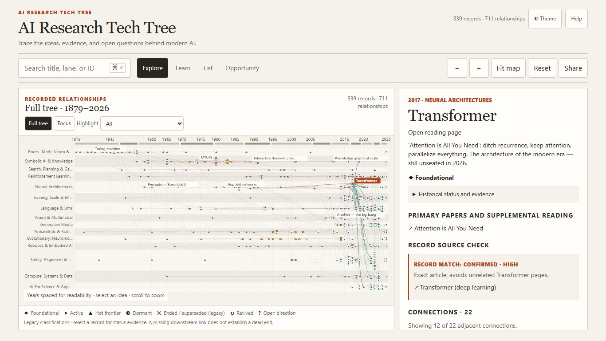

# AI Research Tech Tree

Explore how ideas in AI connect, and inspect the evidence behind each connection.

[Open the published atlas](https://neb6dav.github.io/ai_tech_tree/) · [Read the Transformer record](https://neb6dav.github.io/ai_tech_tree/nodes/transformer/) · [Suggest a correction](https://github.com/neb6dav/ai_tech_tree/issues/new/choose)

This repository contains 339 curated records, 711 recorded relationships, linked
papers, and 15 open research directions. It supports learning and source discovery;
the map is selective and is not a peer-reviewed scientific knowledge base.

## Desktop workspace

The desktop redesign opens the full chronological tree beside a persistent
reading/evidence pane. Follow ideas across fields, highlight dormant,
ended/superseded or revived work, and switch to Focus for a close reading.
Search the complete atlas, inspect a relationship, follow a learning path,
or open a readable record page. Historical categories retain their original
uncertainty and source-review notes.



The redesigned workspace is a release candidate on its development branch.
The published site remains the separately tagged v1.2.1 release until an approved
promotion. See [the validation record](docs/DESKTOP_VALIDATION.md),
[the redesign decision](docs/DESKTOP_REDESIGN.md) and
[the release/decision ledger](docs/ROADMAP_DECISIONS.md) for scope and status.

## Read the evidence

Relationship meaning and evidence strength are separate. Direct, partial,
contextual, editorial, unassessed, and hypothesis grades are not interchangeable.
Most relationships still need individual source review. A visible connection
or nearby position does not by itself establish influence, causality, or novelty.

The [Transformer source-review pilot](src/research/transformer-evidence-pilot.json)
adds narrow primary-source notes for its 22 recorded connections. These notes
are AI-assisted drafts pending curator review. They do not change canonical
evidence grades or the citable dataset. Missing or unresolved evidence stays
visible rather than being filled with a plausible story.

[Methodology](METHODOLOGY.md) · [Contribution requirements](CONTRIBUTING.md)

## Research roadmap

The Opportunity corpus records capabilities, constraints, refinements,
applications, competing approaches, and explicit hypotheses. Its diffusion alpha
contains 60 nodes, 94 relationships, 78 source URLs, eight constraints, and eight
hypothesis cards. Its import status remains `imported_unreviewed`.

Future Combinatorial Lens and Hypothesis Workbench capabilities remain on the
[roadmap](PLAN.md#potential-later-editions--combinatorial-exploration). They would
help compare ideas and develop testable proposals while retaining source IDs,
provenance, uncertainty, and human review. A dataset-derived candidate is not
proof of a discovery or a globally novel combination.

## Data and citation

- [JSON](ai-research-tech-tree.json), [JSON-LD](ai-research-tech-tree.jsonld), and
  [NDJSON](ai-research-tech-tree.ndjson) describe the historical atlas.
- The [Opportunity data](src/data/opportunities/diffusion-models.alpha.json) and
  [schema](src/data/opportunities/opportunity-map.schema.json) have a separate
  authority and remain available at their existing public `/data/opportunities/`
  URLs. Compatibility paths are retained.
- Static `/nodes/<id>/` pages and application `#node=<id>` links refer to the same
  stable canonical records. Downloads support retrieval and research workflows.
- [CITATION.cff](CITATION.cff) identifies the v1.0.0 dataset, edition
  `2026-08-21-stable-1`. An interface release does not silently create a new
  dataset edition. Consult the sources before making scientific claims.

## Develop locally

Use Node.js 24 and npm 11. The lockfile is authoritative.

```sh
npm ci
npm run build
npm run preview
```

Open the local URL printed by `preview`. It serves the staged publication,
including downloads and compatibility paths. In another terminal:

```sh
npx playwright install chromium firefox webkit
npm run test:fast
npm test
```

The build generates the self-contained application, machine exports, reading
pages, and sitemap. No framework or backend is required. Browser checks use
Playwright. Chromium runs by default; set `AI_TREE_BROWSER=firefox` or `webkit`
to run `node --test tests/workspace-browser.test.mjs` against another engine.

Canonical authoring files live under `src/data/atlas/`; Opportunity records live
under `src/data/opportunities/`. The desktop UI lives under `src/workspace/`.
Generated publication artifacts remain committed. Test results and measurement
environments belong in the validation record, not in the product's opening copy.

## Contribute

Report a bug or propose a correction through issues. For content changes, name
the affected IDs, the exact claim, a durable source and locator, and what remains
uncertain. Disclose material AI assistance. Follow [CONTRIBUTING.md](CONTRIBUTING.md)
for review and validation; the maintainer retains editorial responsibility.

## License

Software: [MIT](LICENSE-CODE). Original atlas prose, annotations, and graph data:
[CC BY-SA 4.0](LICENSE-CONTENT). Linked third-party works retain their own rights;
see [THIRD_PARTY_NOTICES.md](THIRD_PARTY_NOTICES.md).

Created and maintained by [@neb6dav](https://github.com/neb6dav).
